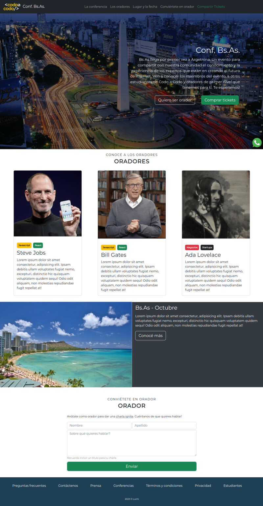
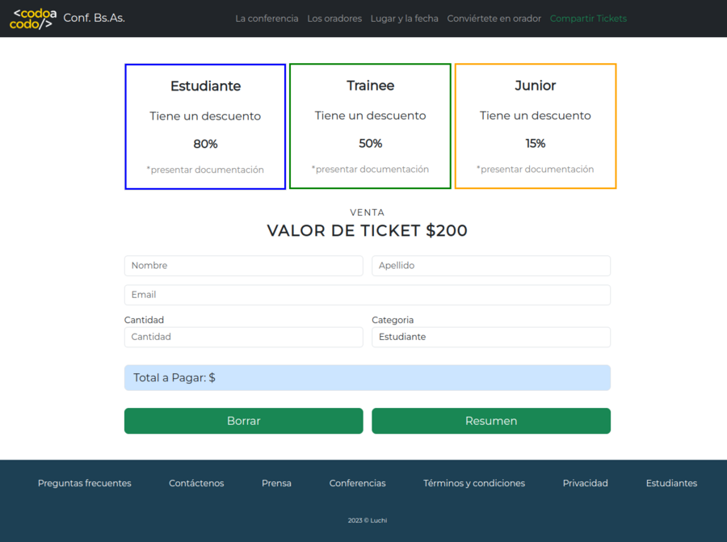

## Conf. Bs.As.
### TP Integrador - Curso Front End
### Ver Pagina : https://admred.github.io/codoacodo/
### Ver Código : https://github.com/admred/codoacodo

### Tecnologías usadas

- Git
- Github
- Boostrap
- Google fonts
- HTML 5
- CSS 3
- Javascript

#### Principal
Landing page que promociona un evento en el cual se brinda información de los Oradores, el Lugar y Fecha y un formulario de contacto al final.
Posee un único enlce funcional que lleva a la página comprar tickets.

#### Formulario Comprar tickets
Esta página calcula el valor total según el descuento elegido y la cantidad de tickets. No puede calcular si hay campos vacios.
Ademas contiene un boton reset para limpiar todos los campos.

  

